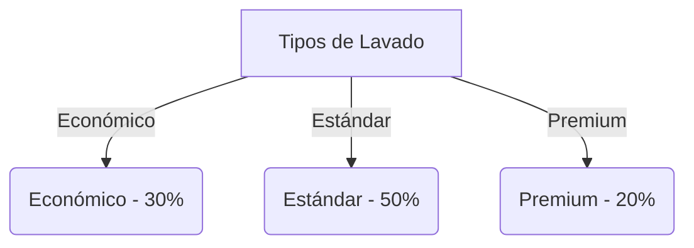
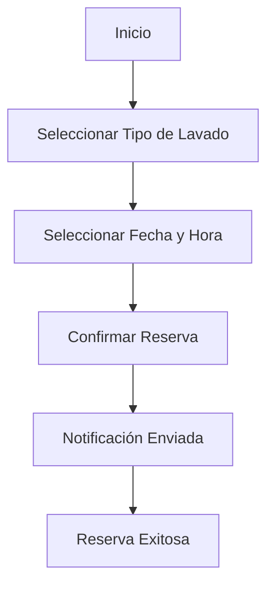
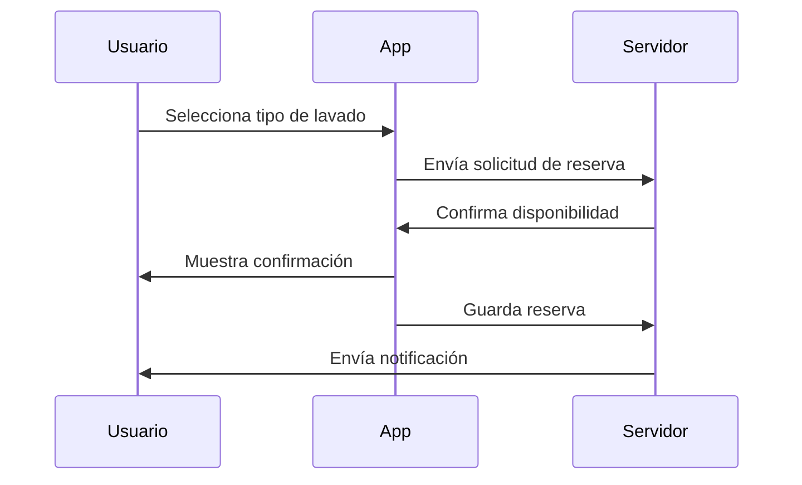
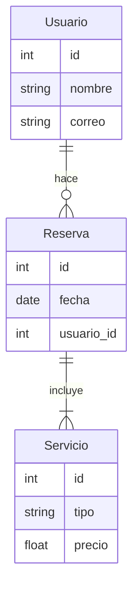
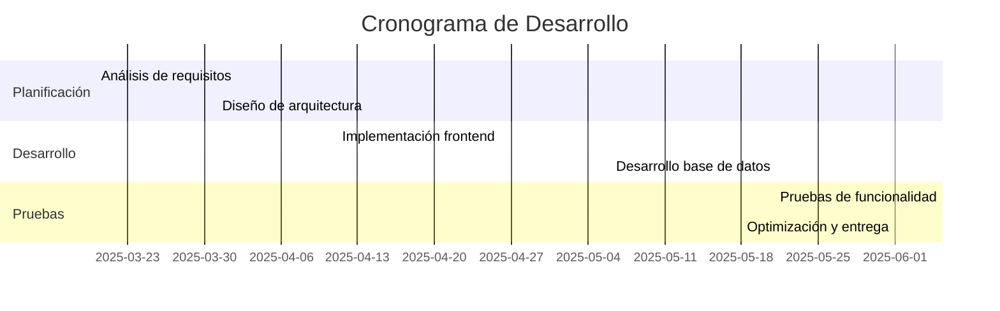
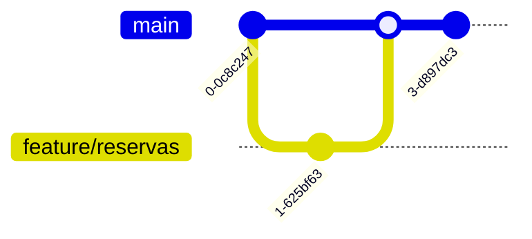
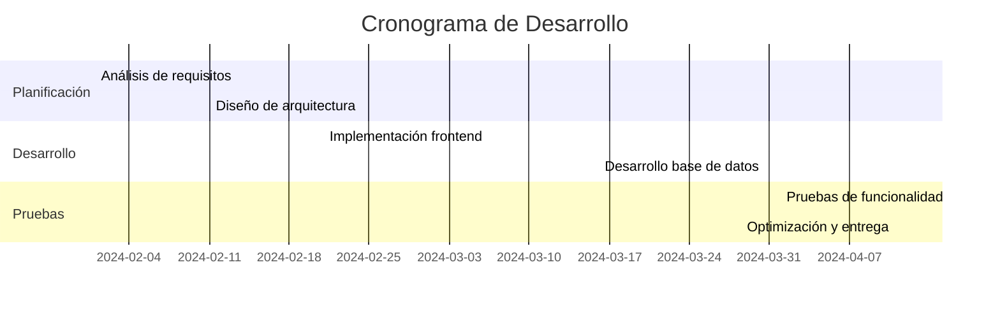
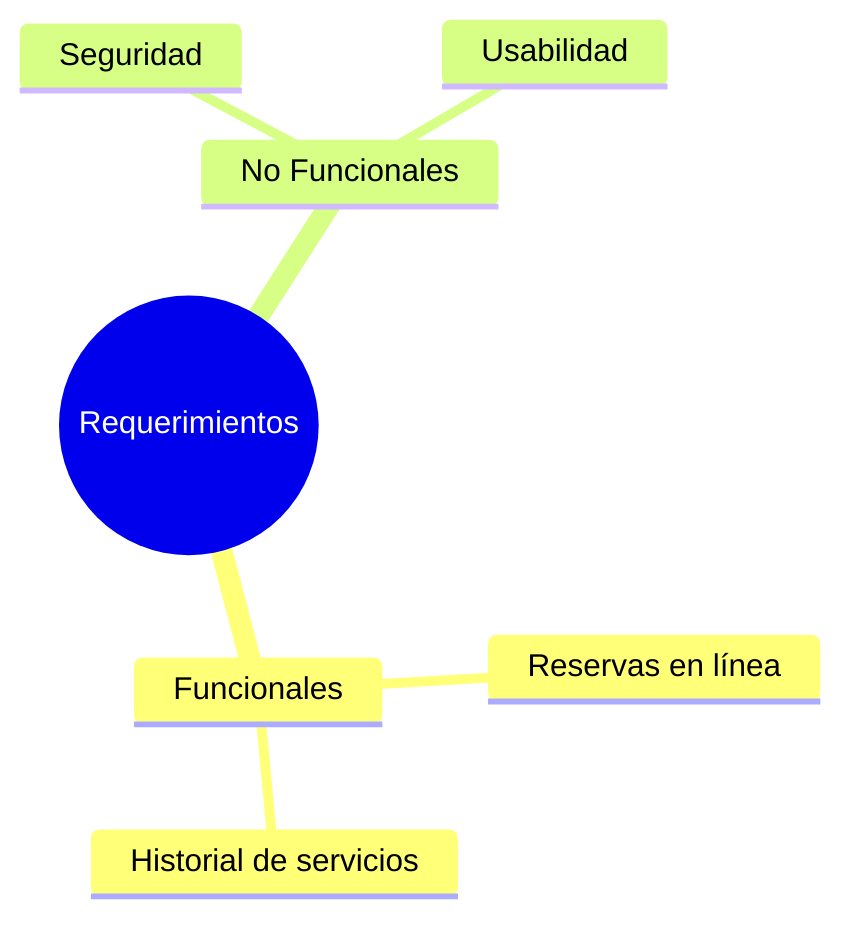

# 🚗 Aplicación Móvil para la Gestión de Reservas en un Lavadero de Coches (CarWash)

---

## 📌 Descripción del Proyecto
Este proyecto consiste en el desarrollo de una aplicación móvil intuitiva para la gestión de reservas en un lavadero de coches. La aplicación permitirá a los clientes:
- Programar citas para el lavado de sus vehículos.
- Seleccionar entre distintos tipos de lavado.
- Consultar su historial de servicios.
- Recibir notificaciones sobre recordatorios y promociones.

🎯 **Objetivos:**
- Desarrollar una aplicación móvil intuitiva.
- Brindar opciones para seleccionar diferentes tipos de lavado disponibles.
- Permitir a los usuarios visualizar su historial de servicios.
- Enviar notificaciones para recordar citas y promociones.

---

## 🏢 Vinculación a Empresa
- No se encuentra vinculada a ninguna empresa.

---

## 📋 Actividades a Realizar

### 🔍 1. Análisis y Planificación
- Definir requisitos funcionales y no funcionales.
- Diseñar la arquitectura de la aplicación.

### 🎨 2. Diseño de la Interfaz
- Crear un prototipo de la aplicación utilizando herramientas de diseño.
- Definir un diseño UX/UI enfocado en mejorar la experiencia del usuario.

### 💻 3. Desarrollo
- Implementación del frontend utilizando Kotlin en Android Studio.
- Desarrollo de la base de datos local en SQL Server.
- Implementación de la lógica de reservas y gestión de usuarios.

### ✅ 4. Pruebas y Optimización
- Realizar pruebas de funcionalidad y usabilidad.
- Optimizar el rendimiento de la aplicación.

---

## 🛠️ Recursos Necesarios

### 🖥️ Hardware
| Recurso | Descripción |
|---------|-------------|
| Equipo Informático | Sistema operativo Windows |
| Conexión a Internet | Necesaria para desarrollo y pruebas |

### 🖥️ Software y Tecnologías
| Software | Uso |
|----------|-----|
| Android Studio | Desarrollo de la aplicación móvil |
| Kotlin | Lenguaje de programación principal |
| SQL Server | Almacenamiento de datos |
| Figma | Diseño de interfaz |

---

## 🌐 Otras Consideraciones
- 🔗 Posible integración con una plataforma web para la gestión administrativa.
- 💳 Evaluación de futuras mejoras como pago en línea y geolocalización de lavaderos cercanos.

---

## 📺 Video Demostrativo

---

## 📊 Gráfica Circular de Tipos de Lavado

---

## 📜 Diagrama de Flujo de Reserva

---

## 🔄 Diagrama de Secuencia de una Reserva

---

## 🗂️ Diagrama Entidad-Relación

---

## 📅 Diagrama Gantt de Desarrollo

---

## 🌳 Diagrama Git Workflow

---

## 📅 Diagrama Gantt de Desarrollo

---

## 📌 Diagrama de Requerimientos

---

## 📞 Contacto
📧 Para más información sobre el proyecto, puedes contactar al equipo de desarrollo.

[Volver al inicio](#🚗-Aplicación-Móvil-para-la-Gestión-de-Reservas-en-un-Lavadero-de-Coches-CarWash)
